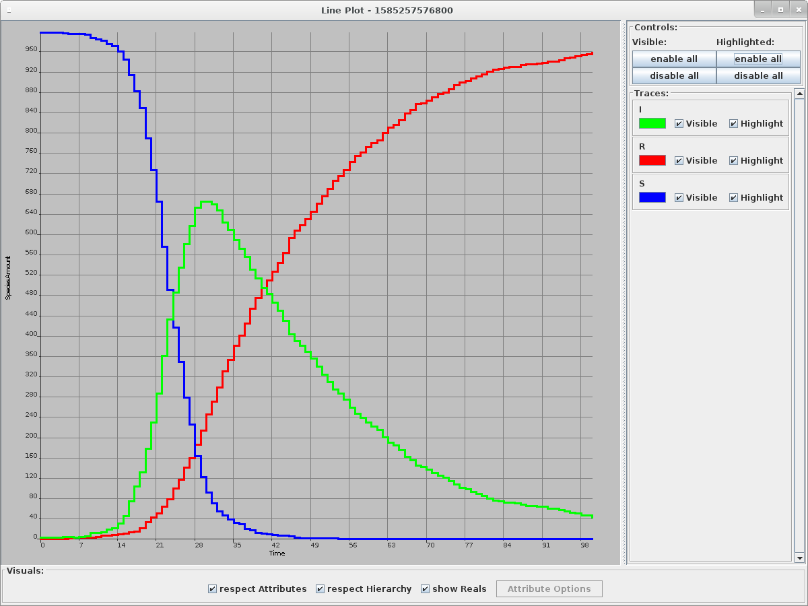

# Rule-based SIR model

This model is based upon the ODE model shown in https://en.wikipedia.org/wiki/Compartmental_models_in_epidemiology#The_SIR_model, which was published by Kermack and McKendrick in 1927 (https://doi.org/10.1098/rspa.1927.0118).

## General ODE-based SIR model
The most general model of a disease that spreads very fast (resulting in an epidemic or even pandemic) is the SIR model comprising the following three equations:

<p align="center">
<!-- \frac{dS(t)}{dt} = - \frac{\beta}{N} S(t) I(t) -->

<!-- \frac{dI(t)}{dt} = \frac{\beta}{N} S(t) I(t) - \gamma I(t) -->

<!-- \frac{dR(t)}{dt} = \gamma I(t) -->

</p>

with the entire population
<p align="center">
<!-- N_\text{total} = S(t) + I(t) + R(t) = const -->

</p>

and the kinetic parameters

<p align="center">
<!-- [\beta = \frac{1}{\tau_C} -->

</p>

and

<p align="center">
<!-- \gamma = \frac{1}{\tau_R} -->

</p>

where

<p align="center">
<!-- \tau_C -->

</p>

is the typical time between contacts and

<p align="center">
<!-- \tau_R -->

</p>

is the typical time until recovery when infected. We call

<p align="center">
<!-- R_0 = \frac{\beta}{\gamma} -->

</p>

the basic reproduction number or basic reproduction ratio. It shows how many susceptible people may be infected by one infectious person.

## General rule-based SIR model

### Conversion of ODEs to rules
In order to have all rules (the number of rules equals the number of kinetic parameters in the ODEs), we must write all rules of every equation and then combine those that share the same kinetic parameter.

1. The first equation as a rule (in ML-Rules syntax):
``` S:s + I:i -> I @ (beta / nTotal) * #s * #i;```

2. The second equation as rules (in ML-Rules syntax):
``` S:s + I:i -> S + I + I @ (beta / nTotal) * #s * #i;```
``` I:i ->  @ gamma * #i;```

3. The third equation as a rule (in ML-Rules syntax):
``` I:i -> R + I @ gamma * #i;```

We now combine all rules with ```(beta / nTotal) * #s * #i``` as reaction rate and then all rules with ```gamma * #i``` as reaction rate.

1. First rule (infection of susceptible person):
``` S:s + I:i -> 2 I @ (beta / nTotal) * #s * #i; ```

2. Second rules (recovery of infected person):
``` I:i -> R @ gamma * #i;```


### ML-Rules model version of general SIR model
Together with the two rules, we can now build a ML-Rules version of the general SIR model. It can be found in [SIR.mlrj](./SIR.mlrj).

A sample simulation can be seen in the following screenshot of the plot by the ML-Rules editor.


